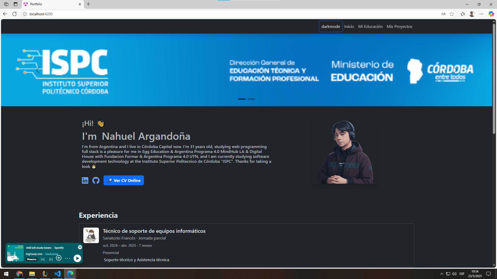

# 💼 Nahuel Argandoña | Portfolio Web

¡Hola! 👋 Soy **Nahuel Argandoña** y este es mi portfolio personal como desarrollador web. Aquí muestro mi recorrido educativo, experiencia formativa y mis proyectos en desarrollo. Esta web está pensada para presentarme profesionalmente y compartir mi CV.

## 🚀 Tecnologías utilizadas

- HTML5  
- CSS3  
- JavaScript - TypeScript
- Aos
- Bootstrap  
- Angular  

> Próximamente:  
- Node.js + Express  
- MySQL

## 📸 Vista previa

  

## 🔧 Cómo ejecutar el proyecto

Este proyecto puede ejecutarse de forma local fácilmente:

1. Cloná el repositorio:
   ```bash
   git clone https://github.com/Aubar48/portfolio_angular
   ```
2. Abrí el archivo `index.html` directamente en tu navegador.

> No se necesita instalación ni servidor local para esta versión inicial.

## 🛠️ Estado del proyecto

✅ Proyecto completado en su primera versión  
🛤️ Futuras mejoras:
- Integrar base de datos MySQL + backend con Node.js
- Sección dinámica de proyectos con datos en tiempo real

## 📄 CV y contacto

- 📥 [Descargar CV](./assets/Curriculum%20Vitae%20Nahuel%20Argandoña.pdf)  
- 🔎 [Ver CV Online](https://www.canva.com/design/DAFoP4HTDqk/YW9Jg6z0ouwf7GeaChLSvg/view?utm_content=DAFoP4HTDqk&utm_campaign=designshare&utm_medium=link2&utm_source=uniquelinks&utlId=he143a9d067)  

- 📧 Contacto: [LinkedIn](https://www.linkedin.com/in/aubar48/)  
- 🌍 Ubicación: Córdoba, Argentina
- 💼 Portfolio: [netlify](https://elegant-pothos-3e7713.netlify.app/)  


La API está corriendo en http://localhost:3000 . Aquí están todas las rutas disponibles para gestionar tu portfolio:

### Usuarios
- GET /api/usuarios - Obtener todos los usuarios
- POST /api/usuarios - Crear un usuario
- POST /api/usuarios/login - iniciar sesion con el usuario
### Presentación
- GET /api/presentaciones - Obtener datos de presentación
- POST /api/presentaciones - Crear presentación (acepta foto)
- PUT /api/presentaciones/:id - Actualizar presentación
- DELETE /api/presentaciones/:id - Eliminar presentación
### Proyectos
- GET /api/proyectos - Obtener todos los proyectos
- POST /api/proyectos - Crear proyecto (acepta foto)
- PUT /api/proyectos/:id - Actualizar proyecto
- DELETE /api/proyectos/:id - Eliminar proyecto
### Experiencia
- GET /api/experiencias - Obtener todas las experiencias
- POST /api/experiencias - Crear experiencia (acepta foto)
- PUT /api/experiencias/:id - Actualizar experiencia
- DELETE /experiencias/:id - Eliminar experiencia
### Educación
- GET /api/educacion - Obtener toda la educación
- POST /api/educacion - Crear educación (acepta foto)
- PUT /api/educacion/:id - Actualizar educación
- DELETE /api/educacion/:id - Eliminar educación

Para las rutas que aceptan fotos, debes enviar los datos como form-data donde el campo de la imagen debe llamarse foto .
Puedes usar herramientas como Postman o Thunder Client para probar estas rutas.


